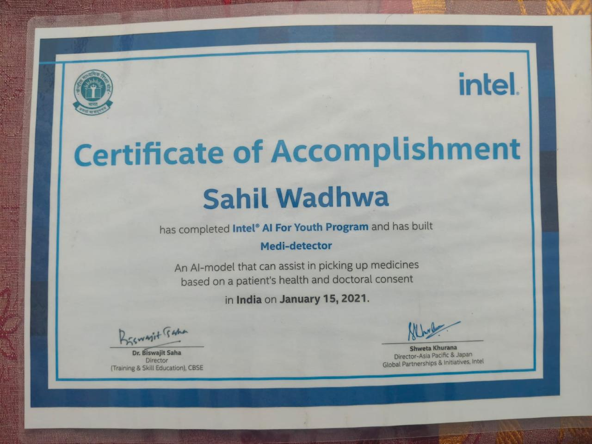
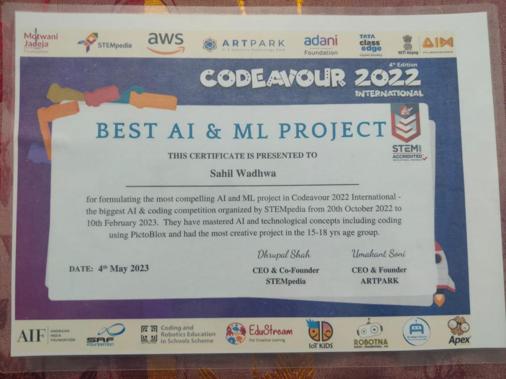

# 🧪 Medi-Detector (2021)

## 📌 Overview

**Medi-Detector** is a machine learning–based healthcare prediction system developed in **2020** under the **Intel AI for Youth – Data Science Bootcamp**.
The system predicts the most suitable medicine based on patient health indicators such as **age, gender, blood pressure, and cholesterol level** using a **Decision Tree classifier**.

The original implementation is preserved without major modifications to reflect authentic learning work and coding style at that time.

---

## 🏆 Achievements

🥇 **Best AI/ML Project Award (International)** — Codeavour 2022

🏅 Developed under the **Intel AI for Youth – Data Science Bootcamp (2021)** and officially recognized by Intel

📜 Certificate:
**Intel Project Certificate**

**Codeavour 2022-Best AI-ML Project(International) Certificate**

---

## 🚀 Features

• Decision Tree–based medicine prediction
• Manual preprocessing and label encoding
• Visualization using scatter plots and histograms
• Confusion matrix evaluation
• Interactive CLI-based prediction system

---

## 📂 Project Structure

medi-detector/
│
├── data/
│   └── Drug2002.csv
│
├── src/
│   └── medi_detector.py
│
├── certificates/
│   └── intel_certificate.png
|   └── codeavour2022_certificate.png
│
├── README.md
├── requirements.txt
└── LICENSE

---

## ⚙️ How to Run

### 1️⃣ Clone Repository

git clone https://github.com/sahilwadhwaofficial-star/medi-detector

### 2️⃣ Install Dependencies

pip install -r requirements.txt

### 3️⃣ Run Project

python src/medi_detector.py

---

## 📊 Model Performance

• Accuracy: **94.5%**
• Balanced precision and recall across classes
• Evaluated using confusion matrix

The model demonstrates strong predictive performance on unseen test data and effectively captures relationships between patient health indicators and medicine selection.

---

## 🧠 Project Background

This project was developed in **2021** during the **Intel AI for Youth – Data Science Bootcamp** and later received the **Best AI/ML Project Award (International)** at Codeavour 2022.

The code is intentionally preserved in its original form to demonstrate early understanding of machine learning fundamentals and problem-solving approach.

---

## 📄 License

This project is licensed under the MIT License.
